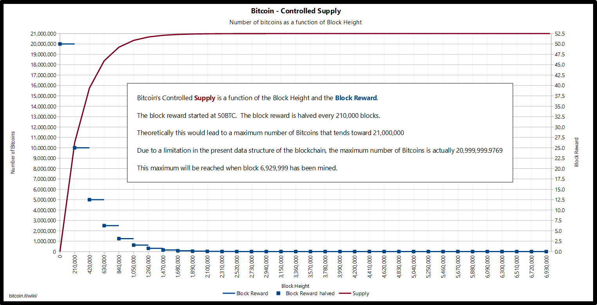
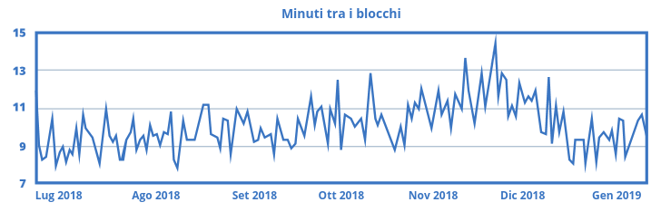
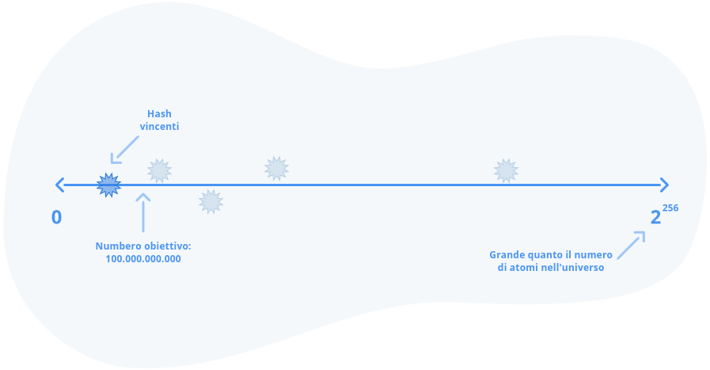
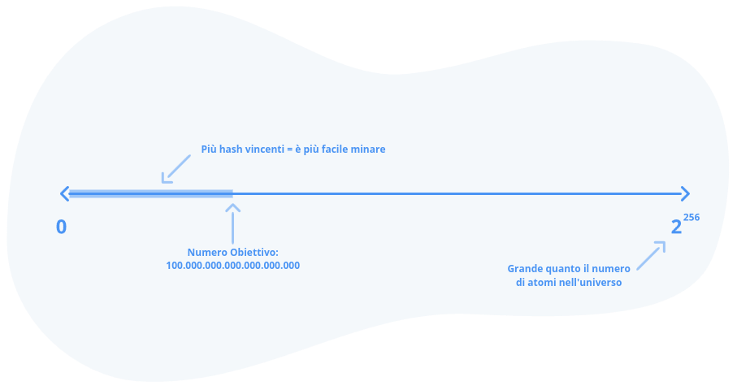
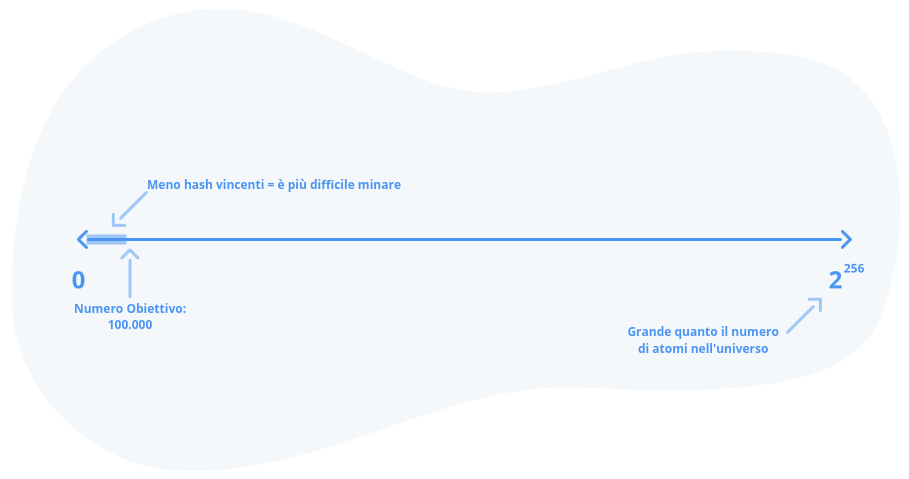
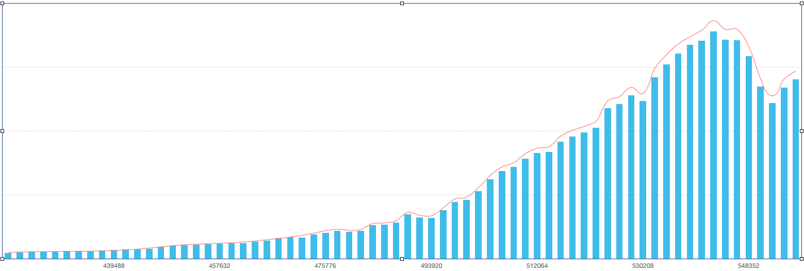

# Mining

Il processo con cui si gioca alla lotteria della prova di lavoro per vincere la possibilità di scrivere sul libro mastro di Bitcoin è noto come *mining*. Ecco come funziona:

1. Chiunque nel mondo voglia partecipare, si unisce alla rete Bitcoin collegando il proprio computer e mettendosi in ascolto delle transazioni.
2. Alice annuncia la sua intenzione di inviare alcune monete a Bob. I computer della rete spettegolano tra loro per diffondere la transazione a tutti i membri della rete.
3. Tutti i computer che vogliono partecipare alla lotteria iniziano a eseguire l'*hashing* delle transazioni di cui sono venuti a conoscenza, aggiungendo *nonce* casuali all'elenco delle transazioni ed eseguendo funzioni di *hashing* sha256. 
4. Ogni circa dieci minuti in media, un computer trova un numero di *hash* derivato da quelle transazioni inferiore al numero *target* corrente e vince la lotteria.
5. Questo computer annuncia il numero vincente che ha trovato, nonché l'input (transazioni e *nonce*) che ha utilizzato per produrlo. Potrebbe averci messo ore o pochi minuti. L'insieme di queste informazioni (transazioni, *nonce* e *hash* della prova di lavoro) è chiamato *blocco*.
6. Tutti gli altri computer validano il blocco verificando che le transazioni contenute in esso insieme al *nonce* corrispondano effettivamente a quanto dichiarato, che l'*hash* sia effettivamente inferiore al *target*, che il blocco non contenga transazioni invalide e che la cronologia al suo interno non sia in conflitto con i blocchi precedenti.
7. Ognuno scrive il blocco nella propria copia del libro mastro, aggiungendolo alla catena di blocchi esistente, creando una *block chain* (N.d.T.: in italiano *catena di blocchi*).

Ecco fatto. Abbiamo prodotto il nostro primo blocco e la nostra prima scrittura sul libro mastro.

Forse hai letto l'affermazione, spesso riportata dai media, secondo cui il *mining* di Bitcoin comporta la risoluzione di equazioni complesse. Ora hai capito che questa affermazione è completamente falsa. Anziché risolvere equazioni, la lotteria del *mining* di Bitcoin consiste nel lanciare ripetutamente un gigantesco dado virtuale per produrre un *hash* entro un certo intervallo di tempo. È semplicemente un gioco di probabilità che obbliga a consumare una certa quantità di elettricità.

## Come vengono coniati i nuovi Bitcoin?

Finora abbiamo discusso di come Alice possa inviare €2 a Bob. Ora non parleremo più di euro, perché Bitcoin non sa nulla sull'euro. Quello che abbiamo sono i bitcoin: unità digitali che rappresentano il valore sulla rete Bitcoin.

Per tornare al nostro esempio, ciò che sta realmente accadendo è che Alice sta inviando 2 bitcoin a Bob annunciando che sta spostando i bitcoin registrati sul suo "conto" a quello di Bob. Qualcuno vince la lotteria della prova di lavoro e scrive la transazione nel libro mastro.

Ma dove ha preso Alice quei 2 bitcoin? Com'è nato Bitcoin e come si faceva ad acquisire monete prima che esistessero luoghi dove acquistarle in cambio di valuta *fiat* tradizionale come l'euro?

Quando Satoshi ha creato Bitcoin, avrebbe potuto creare un database con tutti i 21 milioni di monete in suo possesso e chiedere ad altre persone di acquistarle da lui. Tuttavia, ci sarebbero stati pochi motivi per attribuire valore a un sistema in cui una sola persona possedeva tutta la ricchezza. Avrebbe potuto creare un registro in cui le persone potevano iscriversi per avere la possibilità di vincere alcune monete utilizzando un indirizzo e-mail, ma questo sarebbe stato suscettibile di *attacco Sybil* (impersonificazione) poiché la generazione di milioni di indirizzi e-mail è pressoché gratuita.

È evidente che il processo di *mining* di bitcoin, che consiste nel giocare alla lotteria della prova di lavoro e ottenere i diritti di scrittura sul libro mastro, è proprio ciò che produce nuove monete. Quando si trova un blocco valido, consumando una grande quantità di energia e trovando un numero che vince la lotteria, si può scrivere qualsiasi transazione di cui si è sentito parlare in quel blocco e quindi nel libro mastro. Ma si ha anche la possibilità di scrivere nel libro mastro una transazione aggiuntiva molto speciale, chiamata *transazione coinbase*. Questa transazione in pratica dice: "12,5 nuovi bitcoin sono stati coniati e dati a Maria, la minatrice, per ricompensarla per aver consumato tutta quella energia per estrarre questo blocco".

È così che vengono coniati nuovi bitcoin. Questo processo consente a chiunque nel mondo di iniziare a coniare i propri bitcoin senza alcuna autorità centrale e senza identificarsi, purché sia disposto a sostenere il costo dell'elettricità necessaria per giocare a questa lotteria. Ciò rende l'emissione di Bitcoin resistente a un attacco *Sybil*. Se vuoi delle monete, dovrai consumare energia e pagare una certa somma di denaro per minarle.

## La ricompensa del blocco

Chi vince la lotteria si regala delle monete di nuovo conio. Perché 12,5 bitcoin e non 1000? Perché non può imbrogliare il sistema e darsi una somma qualsiasi?

Bitcoin è un sistema di *consenso distribuito*. Ciò significa che tutti devono essere d'accordo su ciò che è valido. Il modo in cui lo fanno è attraverso l'esecuzione di un software sul proprio computer che applica un insieme di regole ben note, conosciute come regole di consenso Bitcoin. Ogni blocco prodotto da un miner viene validato attraverso queste regole. Se supera il test, tutti lo inseriscono nel proprio libro mastro e lo accettano come verità. In caso contrario, il blocco viene rifiutato.

Sebbene l'elenco completo delle regole di consenso sia piuttosto complesso, ecco alcuni esempi:

- Un blocco valido può coniare una quantità specifica di bitcoin, determinata dal programma di emissione scritto nel software.
- Le transazioni devono avere firme corrette che indichino che le persone che spendono tali monete abbiano autorizzato correttamente tali spese.
- Non ci possono essere transazioni che spendono monete che sono state precedentemente spese in questo blocco o in un blocco precedente.
- I dati del blocco non devono superare una determinata dimensione.
- L'*hash* della prova di lavoro del blocco deve essere inferiore all'attuale *target*, dimostrando l'improbabilità statistica di estrarre questo blocco in qualsiasi modo che non sia quello di aver consumato una certa quantità di elettricità.

Se Maria estrae un blocco e decide di regalarsi un piccolo extra, i computer di tutti gli altri *rifiutano* questo blocco in quanto *invalido*, perché all'interno del software client Bitcoin che tutti stanno eseguendo, c'è un pezzo di codice che dice "l'attuale ricompensa del blocco è di esattamente 12,5 bitcoin". Se vedete un blocco che concede a qualcuno più di questo, non accettatelo".

Se Maria tenta di imbrogliare e di produrre un blocco *invalido*, il blocco non verrà scritto su alcun libro mastro e lei avrà sprecato migliaia di euro di elettricità per produrre qualcosa che nessuno vuole: un falso. Questo conferisce a Bitcoin la cosiddetta *unforgeable costliness* (N.d.T.: la caratteristica in base alla quale è praticamente impossibile ed economicamente sconveniente tentare di falsificarlo ma, allo stesso tempo, è assolutamente facile per gli altri partecipanti verificarne l'autenticità e misurare il costo sostenuto per la sua produzione), un termine coniato dal pioniere della valuta digitale Nick Szabo nel suo saggio *Shelling Out*. Intuitivamente, sappiamo che se il denaro fosse molto facile da falsificare, non sarebbe molto utile come denaro. Bitcoin è di fatto impossibile da contraffare, in quanto è verificabile con un semplice controllo matematico.

Il primissimo blocco a essere estratto per coniare i primi bitcoin è stato minato da Satoshi e ci si riferisce a esso con il termine *blocco genesi*. Il codice è *open source*, il che significa che chiunque può esaminare il suo funzionamento e verificare che non ci sia nulla che non va nel protocollo. Persino Satoshi ha dovuto eseguire miliardi di calcoli e giocare alla lotteria della prova di lavoro per estrarre i primi blocchi. Nonostante fosse il creatore del sistema, nemmeno lui poteva produrre un falso fingendo il consumo di elettricità necessario.

Chiunque si sia unito alla rete dopo di lui è stato in grado di controllare il numero di *hash* generati rispetto al *target* iniziale e ai dati delle transazioni per verificare che avesse effettivamente raggiunto un *target* statisticamente raro consumando una certa quantità di energia. Immaginate di poter controllare il modo in cui il sistema bancario *fiat* tradizionale conia il denaro in un modo così preciso e in tempo reale!

## L'Halving

Il processo di *mining* produce nuovi bitcoin. Ma Satoshi voleva un sistema che non si potesse *svalutare*. Non voleva che l'offerta monetaria si espandesse in continuazione. Al contrario, ha concepito un programma di emissione che partiva rapidamente e si attenuava nel tempo fino ad arrivare a zero nuove monete coniate per anno.

All'inizio, la ricompensa del blocco era di 50 bitcoin, quindi questo è il compenso ricevuto da Satoshi per aver estratto il primo blocco, così come le altre persone che si sono unite alla rete nei primi giorni e hanno estratto i primi blocchi.

Il codice di Bitcoin, ogni circa quattro anni, applica un dimezzamento della ricompensa del blocco. La ricompensa si basa sul numero di blocchi estratti, piuttosto che sul tempo trascorso, ma non fa molta differenza perché i blocchi vengono prodotti approssimativamente ogni dieci minuti.

La ricompensa dei blocchi nel 2008 era pari a 50, nel 2012 era pari a 25, nel 2016 era pari a 12,5. Ad oggi, 8 giugno 2019, sono stati estratti 579.856 blocchi dall'inizio della storia di Bitcoin e la ricompensa è di 12,5 bitcoin per blocco (N.d.T.: 792.255 blocchi e 6,25 bitcoin di ricompensa per blocco, mentre sto traducendo il libro).

Tra 50.144 blocchi, o approssimativamente alla fine di maggio 2020, la ricompensa scenderà a 6,25 bitcoin per blocco, portando a un tasso di aumento annuale dell'offerta di circa l'1,8% (N.d.T.: è successo l'11 maggio 2020). Tra dodici anni, a seguito di altri tre dimezzamenti della ricompensa, oltre il 99% di tutti i bitcoin sarà stato estratto e verrà prodotto meno di 1 bitcoin per blocco. È possibile monitorare i progressi del dimezzamento della ricompensa dei blocchi su <bitcoinblockhalf.com>.

Un giorno, intorno all'anno 2140, la ricompensa dei blocchi sparirà del tutto e i minatori saranno incentivati solo dalle commissioni pagate da chi esegue le transazioni.

Questi numeri di emissione e di ricompensa dei blocchi sono stabiliti nel codice Bitcoin - che, per ricordarlo, è completamente *open source* e può essere verificato da chiunque - quindi, a seconda di quanto siamo avanti nella storia di Bitcoin, produrre un blocco che non segue queste regole verrà rifiutato da tutti gli altri che stanno applicando le stesse regole scritte nel loro codice.

## Controllo dell'emissione e del tempo di estrazione

Il *mining* richiede capacità di calcolo ed elettricità, quindi più hardware ed energia si hanno a disposizione, maggiore è la probabilità di trovare il numero vincente rispetto agli altri partecipanti. Ad esempio, se sulla rete ci sono 100 computer di pari potenza e tu ne controlli 10, troverai il blocco vincente *circa* il 10% delle volte. Tuttavia, il *mining* è un processo basato sul caso e sulla casualità, quindi è possibile che passino ore o addirittura giorni senza che si riesca a trovare un blocco.

Sappiamo dalla sezione precedente che i minatori non possono concedersi ricompense arbitrarie per i blocchi, altrimenti verrebbero rifiutati dagli altri nodi. Ma cosa succederebbe se consumassero un sacco di energia per accelerare l'estrazione dei blocchi e mettere le mani su un sacco di bitcoin, violando il vincolo di progettazione secondo cui il programma di emissione deve essere noto in anticipo?

Riprendiamo l'esempio di 1000 possibili *hash* e un *target* pari a 100. Ciò significa che il 10% delle volte otterremo un numero inferiore a 100 e troveremo un blocco.

Supponiamo di impiegare 1 secondo per calcolare ogni *hash*. Se ogni secondo "tiriamo il nostro dado" facendo l'*hashing* delle transazioni correnti e del nostro *nonce* casuale, e il 10% delle volte otteniamo un numero inferiore al *target*, allora prevediamo che ci vorranno circa 10 secondi in media per trovare un *hash* valido.

Cosa succede se due computer giocano alla lotteria? La velocità di *hashing* è doppia, quindi ci aspettiamo di trovare un *hash* valido entro 5 secondi. E se a giocare sono 10 computer? Uno di essi troverà un *hash* vincente all'incirca ogni secondo. 

Questo crea un problema: se più persone effettuano *mining*, i blocchi verranno prodotti troppo velocemente. Questo comporta due conseguenze indesiderate:

1. Ciò interferisce con l'idea di avere un programma di emissione predeterminato. Vogliamo che venga emesso un numero relativamente costante di bitcoin all'ora per essere sicuri di emetterli tutti entro il 2140, e non prima.
2. Si creano problemi di rete: se i blocchi vengono estratti così rapidamente da non avere il tempo di raggiungere l'intera rete prima che venga estratto il successivo, non è possibile raggiungere il consenso su una cronologia lineare delle transazioni, poiché più minatori possono includere la stessa transazione nei loro blocchi, con la conseguenza che i blocchi non sono validi perché contengono transazioni che sono già state spese in altri blocchi.

Se invece ci sono meno persone che minano, si crea il problema opposto:

1. I bitcoin vengono emessi troppo lentamente, interferendo nuovamente con il programma di emissione.
2. Il sistema può diventare inutilizzabile perché le persone aspettano ore, giorni o più a lungo per scrivere una transazione sul libro mastro.

Il numero totale di *hash* al secondo eseguiti da tutti i minatori della rete Bitcoin viene definito *hash rate*.

## Aggiustamento della difficoltà: accordarsi sul target

Poiché Bitcoin è un sistema volontario e senza permessi in cui le persone possono partecipare a piacimento, senza che nessuno sia al comando, il numero di minatori in ogni momento varierà notevolmente. Abbiamo bisogno di un modo per mantenere costante la produzione di blocchi, senza accelerare e rallentare ogni volta che si aggiungono nuovi minatori o quando i minatori esistenti se ne vanno.

Come possiamo fare in modo che sia più difficile trovare *hash* validi se più giocatori si uniscono alla lotteria e più facile se i giocatori lasciano la lotteria, in modo da mantenere costanti i tempi di emissione e di blocco?

Teniamo a mente che il *mining* di Bitcoin è una lotteria in cui si cerca di produrre un numero casuale più piccolo del *target*:

Bitcoin risolve questo problema con un *aggiustamento della difficoltà di estrazione*. Poiché tutti eseguono lo stesso codice, che applica le stesse regole, e tutti hanno una copia dell'intera storia dei blocchi fino a questo momento, ognuno può calcolare in modo indipendente quanto velocemente vengono prodotti i blocchi.

Ogni volta che vengono prodotti 2016 blocchi, che equivalgono all'incirca a due settimane di tempo[[2]](ch010-notes.md#l2) , ci guardiamo indietro e calcoliamo quanto tempo è stato impiegato per produrre questi blocchi, dopodiché regoliamo il *target* per accelerare o rallentare la produzione dei blocchi.

Ognuno prende gli ultimi 2016 blocchi e li divide per il tempo impiegato a produrli per creare una media. Il risultato è superiore a dieci minuti? Stiamo andando troppo piano. È inferiore a dieci minuti? Stiamo andando troppo veloci.

Ora possiamo regolare il *target* in modo che si alzi o si abbassi proporzionalmente a quanto più veloci o lenti vogliamo andare in base all'intervallo di 10 minuti che è scritto nel codice *open source*.

Possiamo aumentarlo a un numero più alto, creando un intervallo più ampio di *hash* validi, dando ai minatori una maggiore possibilità di trovare un *hash* vincente, spendendo così meno energia per ogni blocco trovato. Questo si chiama *abbassare la difficoltà*.

In alternativa, possiamo abbassarlo in modo che meno *hash* siano validi e i minatori debbano spendere più energia per trovare un *hash* valido. Questo si chiama *aumentare la difficoltà*.

Ciò significa che per ogni periodo di 2016 blocchi, sappiamo esattamente qual è il *target*. Questo ci permette di conoscere la soglia magica sotto della quale il numero di *hash* della prova di lavoro deve scendere per ottenere un biglietto della lotteria vincente per qualsiasi blocco prodotto in quel periodo.

L'aggiustamento della difficoltà e il calcolo del *target* sono forse l'innovazione chiave di Bitcoin, in quanto consentono a tutti di verificare in modo indipendente i numeri della lotteria sulla base di un *target* che possono calcolare, sempre in modo indipendente, nello stesso identico modo con cui lo fanno tutti gli altri. Ciò consente di organizzare una lotteria senza che nessuno debba comunicarci la combinazione vincente.

Il grafico sottostante mostra l'*hash rate* come una linea e la difficoltà come barre nel tempo. La difficoltà ha l'aspetto di una scala perché viene regolata con incrementi di 2016 blocchi. Si può notare che ogni volta che l'*hash rate* sale al di sopra della difficoltà, la difficoltà sale per raggiungerlo. Quando l'*hash rate* diminuisce, come nel periodo ottobre-dicembre 2018, la difficoltà diminuisce. L'aggiustamento della difficoltà è sempre in ritardo rispetto all'*hash rate* all'interno del periodo di difficoltà del blocco 2016 (due settimane).

Poiché c'è un ritardo di 2016 blocchi per l'aggiustamento della difficoltà, è possibile che picchi significativi in alto o in basso nell'*hash rate* producano Bitcoin in eccesso o in difetto durante quel periodo di 2016 blocchi, distorcendo leggermente il programma di emissione.

Poiché incrementare l'*hash rate* vuol dire generalmente produrre una grande quantità di nuovo hardware, i picchi sono relativamente insoliti e non hanno un impatto eccessivo. Gli effetti dei picchi sono limitati alla finestra di 2016 blocchi in cui si verificano, poiché il successivo aggiustamento della difficoltà ci riporta alla media di dieci minuti per blocco.

## Hash rate e valore in euro di Bitcoin

Bitcoin ricalcola automaticamente la difficoltà in base alla potenza di calcolo totale di tutti i giocatori della lotteria, che sono i minatori che consumano energia attraverso l'*hashing*. È qui che il mondo reale inizia a toccare il nostro mondo digitale. Il prezzo di bitcoin, il prezzo dell'hardware e dell'energia e il *target* della difficoltà creano dei circoli virtuosi:

1. Gli speculatori comprano bitcoin perché pensano che stia salendo, facendo salire il prezzo a X dollari.
2. I minatori spendono fino a X dollari di energia e hardware per cercare di estrarre un bitcoin.
3. L'elevata domanda da parte degli acquirenti provoca un aumento del prezzo e spinge altri minatori a estrarre bitcoin con un notevole profitto.
4. Più minatori vuol dire più *hash rate*, più energia spesa per la produzione di bitcoin e la rete diventa ancora più sicura. Gli acquirenti sono rassicurati sulla sicurezza di Bitcoin, il che a volte porta a un ciclo virtuoso che fa salire ulteriormente il prezzo.
5. Dopo 2016 blocchi, la disponibilità di un nuova potenza di *hash* provoca un aggiustamento della difficoltà verso l'alto.
6. Una difficoltà maggiore significa un *target* più basso - i minatori trovano i blocchi con meno frequenza - e questo fa sì che almeno alcuni di loro spendano più di X dollari in costi operativi per minare un blocco.
7. Alcuni minatori diventano non redditizi, spendendo più energia per il *mining* di quanto possano guadagnare vendendo i bitcoin. Spengono i loro computer e l'*hash rate* totale diminuisce.
8. Passano altri 2016 blocchi. La difficoltà viene ricalcolata per diventare più facile, dato che alcuni minatori sono andati offline. Il *target* viene aumentato.
9. Una difficoltà più bassa significa che i minatori che in precedenza non erano redditizi possono tornare online e minare, oppure che nuovi minatori saranno incentivati a unirsi al gioco.
10. Torna al punto 1.

In un mercato al ribasso, il ciclo può andare nella direzione opposta, con gli utenti che si liberano delle monete, facendo scendere il prezzo e rendendo i minatori non redditizi.

L'algoritmo di regolazione della difficoltà assicura che ci sia sempre un equilibrio tra il prezzo e la quantità di *hash rate* sulla rete. Anche se il prezzo dovesse calare drasticamente e far crollare metà dell'*hash rate* attuale, il successivo aggiustamento della difficoltà renderebbe il *mining* nuovamente redditizio al nuovo prezzo di equilibrio.

La natura dell'aggiustamento della difficoltà elimina i minatori inefficienti a favore di quelli che operano con l'energia più economica possibile e con i costi operativi complessivi più bassi. Nel tempo, questo costringe i minatori di bitcoin a spostarsi nelle zone più remote del mondo, utilizzando fonti energetiche sotto-utilizzate o completamente inutilizzate. Un rapporto di CoinShares[[3]](ch010-references.md#l2)  del 2019 ha stimato che circa il 75% del *mining* di bitcoin è alimentato da energia rinnovabile. Negli ultimi anni, il prezzo è salito molto rapidamente, così come l'*hash rate* totale. Più alto è l'*hash rate*, più difficile è attaccare la rete perché per controllare ciò che viene scritto anche solo nel blocco successivo, bisognerebbe avere sotto il proprio controllo tanta energia e hardware quanto più della metà dell'intera rete. Oggi si stima che l'energia spesa dalla rete di minatori Bitcoin sia equivalente a quella di un paese di medie dimensioni.

## Commissioni e la fine delle ricompense dei blocchi

Se la ricompensa dei blocchi finirà, come potremo continuare a incentivare i minatori a consumare energia per proteggere il libro mastro? La risposta di Bitcoin sono le commissioni di transazione. Queste non solo sostituiscono nel tempo la ricompensa del blocco, ma più in generale incentivano i minatori a includere le transazioni nei blocchi, in modo che non si limitino a minare quelli vuoti per ottenere la ricompensa.

Le commissioni sono determinate da un sistema di libero mercato in cui gli utenti fanno offerte per lo spazio scarso disponibile in un blocco. Gli utenti che inviano transazioni indicano l'importo delle commissioni che sono disposti a pagare ai minatori e questi ultimi possono includere o meno le transazioni che vedono a seconda delle commissioni. Quando ci sono poche transazioni in attesa di entrare nel blocco successivo, le tariffe tendono a essere molto basse, perché non c'è concorrenza. Quando lo spazio tra i blocchi si riempie, gli utenti sono disposti a pagare tariffe più alte affinché le loro transazioni vengano confermate più rapidamente (entro il blocco successivo). Coloro che vogliono risparmiare possono sempre fissare le loro commissioni a un livello basso e aspettare più a lungo per essere inclusi successivamente, quando lo spazio del blocco sarà più disponibile.

Nei sistemi finanziari tradizionali, le commissioni tendono a basarsi su una percentuale dell'importo trasferito. In Bitcoin, il valore trasferito non ha alcuna influenza sulle commissioni. Le commissioni sono invece proporzionali alla risorsa scarsa che consumano: il *block space* (N.d.T. in italiano *spazio del blocco*). Le commissioni sono misurate in satoshi per byte (8 bit) di spazio consumato. Pertanto, una transazione che invia un milione di bitcoin da una persona a un'altra potrebbe essere più economica di una che divide 1 bitcoin tra 10 destinatari, perché quest'ultima richiede più *block space* per essere rappresentata.

In passato, ci sono stati periodi in cui Bitcoin era molto richiesto, come nel caso della massiccia corsa al rialzo di fine 2017. In quel periodo, le commissioni sono diventate estremamente elevate. Da allora sono state implementate alcune nuove funzionalità per ridurre la pressione delle commissioni sulla rete. 

Una di queste si chiama *Segregated Witness* (N.d.T.: abbreviato in *SegWit*), che ha riorganizzato il modo in cui vengono rappresentati i dati dei blocchi. Le transazioni che traggono vantaggio da questo aggiornamento possono utilizzare più spazio rispetto a 1MB originariamente previsto come limite per ciascun blocco; ciò avviene grazie ad alcuni accorgimenti tecnici che esulano dallo scopo di questo libro. 

L'altro alleggerimento delle commissioni è avvenuto grazie al cosiddetto *batching*: gli *exchange* e altri operatori ad alto volume nell'ecosistema hanno iniziato a combinare le transazioni in bitcoin per più utenti in un'unica transazione. A differenza di un pagamento tradizionale in banca o su PayPal, che avviene da una persona a un'altra, una transazione Bitcoin può combinare un gran numero di input e produrre un gran numero di output. In questo modo, un *exchange* che deve inviare bitcoin a 100 persone che hanno fatto un prelievo può farlo in un'unica transazione. Si tratta di un utilizzo molto più efficiente del *block space*, che trasforma quella che apparentemente è solo una manciata di transazioni di bitcoin al secondo in migliaia di pagamenti al secondo.

*Segregated Witness* e il *batching* hanno già fatto un ottimo lavoro nel ridurre la domanda di spazio nei blocchi. Sono in programma ulteriori miglioramenti per rendere più efficiente l'uso dello spazio. Ciononostante, arriverà il momento in cui le tariffe di Bitcoin torneranno a essere elevate, poiché i blocchi saranno sempre più pieni a causa della domanda.

Abbiamo quasi completato l'invenzione di Bitcoin:

1. Sostituita una banca centrale con un libro mastro distribuito.
2. Istituito un sistema di lotteria per selezionare chi scrive sul libro mastro.
3. Obbligo per i partecipanti alla lotteria di consumare energia per acquistare i biglietti tramite *hashing* e facilità di verifica dei biglietti vincenti da parte di tutti, controllando i numeri di *hash* prodotti dai giocatori rispetto a un numero *target* calcolato in modo indipendente.
4. Abbiamo detto ai giocatori della lotteria che se non avessero rispettato le regole, avremmo rifiutato i loro blocchi, comprese le loro transazioni *coinbase*, in modo da non essere pagati in caso di vincita, creando così un disincentivo economico alla frode e un incentivo economico al rispetto delle regole.
5. Controllata la tempistica e la selezione del *target* per la lotteria, lasciando che ognuno calcoli da solo quale debba essere il *target* in base alle regole codificate e alla storia degli ultimi 2016 blocchi.
6. Applicato il programma di emissione utilizzando aggiustamenti di difficoltà che si adattano all'aumento o alla diminuzione dell'*hash rate*.
7. Utilizzato codice *open source* per garantire che tutti possano verificare da soli che stanno applicando le stesse regole relative alla validità delle transazioni, alla ricompensa dei blocchi e al calcolo della difficoltà.

Nessun ente centrale. Abbiamo un sistema completamente distribuito e decentralizzato. Abbiamo quasi l'intero quadro della situazione. Rimane un problema. Quando qualcuno si unisce alla rete e chiede di avere copie del libro mastro, può ottenere storie diverse del libro mastro da nodi diversi. Come possiamo imporre una cronologia unica e lineare, e come possiamo impedire ai minatori di riscrivere il passato?
